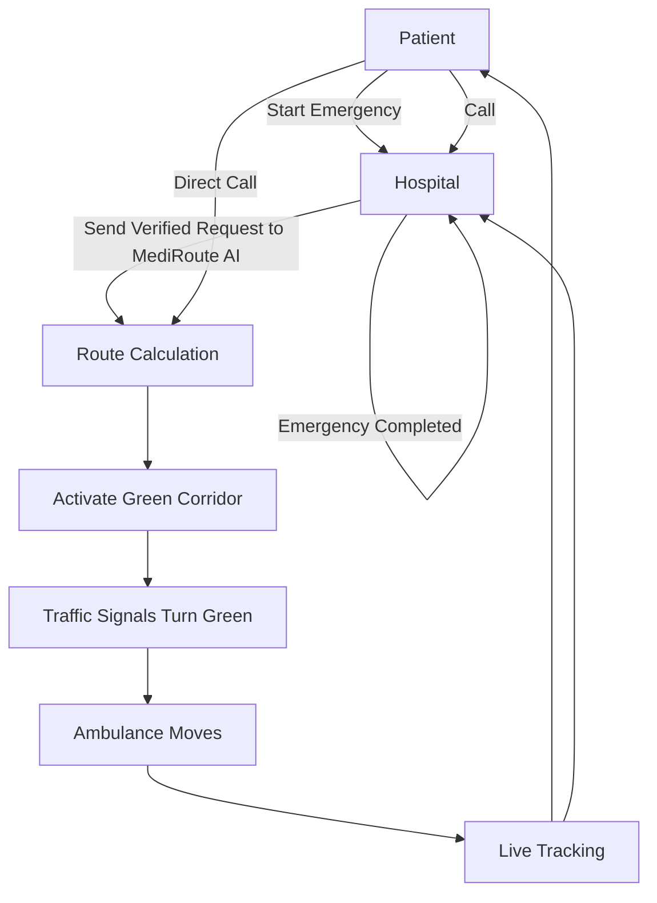

# Emergency Workflow

## Workflow Steps

1. **Emergency Initiation**: Patient calls hospital or directly contacts emergency services
2. **Hospital Response**: Hospital verifies emergency and assigns nearest available ambulance
3. **Route Calculation**: MediRoute AI calculates optimal route considering traffic conditions
4. **Green Corridor Activation**: System automatically activates traffic signal priority
5. **Traffic Control**: All signals along the route turn green for ambulance passage
6. **Live Tracking**: Real-time GPS tracking provides updates to hospital and patient
7. **Emergency Completion**: System confirms ambulance arrival and resets traffic signals