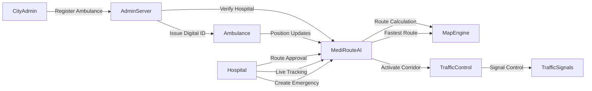

# System Architecture

## Components

- **CityAdmin**: Manages ambulance registration and fleet oversight
- **AdminServer**: Handles authentication and verification processes
- **Ambulance**: Real-time GPS tracking and emergency response
- **Hospital**: Emergency management and route coordination
- **MediRouteAI**: Core system for route optimization and traffic control
- **MapEngine**: Route calculation and navigation services
- **TrafficControl**: Automated traffic signal management
- **TrafficSignals**: Physical traffic infrastructure integration